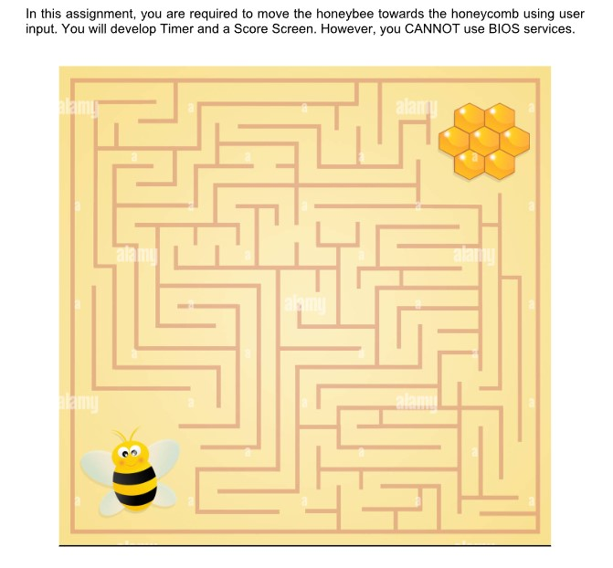
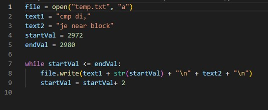
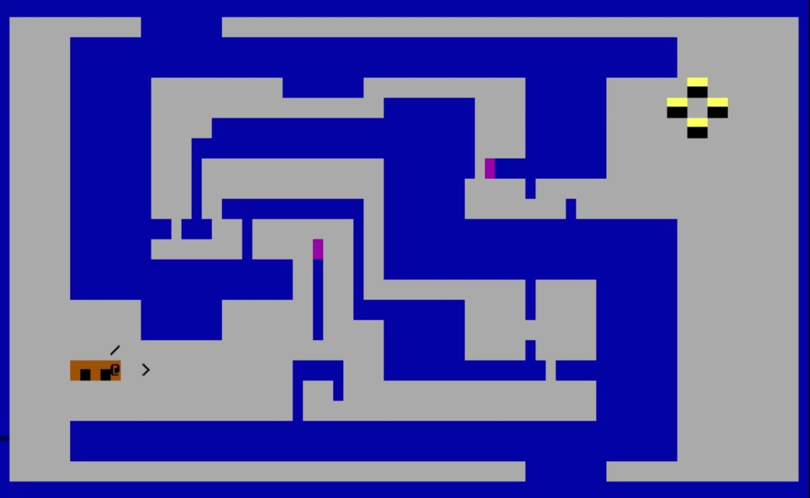

# Maze Game in Assembly Language 🚀 

### A maze game that utilizes all the concepts used throughout the course. I used: 
- #### subroutines
- #### video memory
- #### jump statements
- #### interrupt concepts
- #### stack

## Problem Statement

### Was not quite familiar with the subroutine concepts at the early stage so I made a python script to ease the hardcoding process 😅 

### Tried to make the project a bit unique by adding portals (pink blocks) 🔴 🏃‍♂️ 🔵 . This can play a major part when I add a timer functionality.

